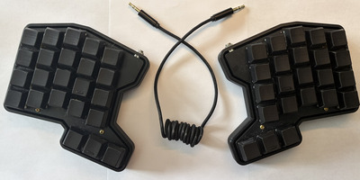

# beniaris46

Features:  
Ortholinear Design  
Split column stagger layout  
USB-C power  
3d printed construction   

Hardware needed for this build:  
2x 3.5 mm ports  
2x arduino promicro usb-c  
1x 3.5 mm cable  
Brass pcb pillar stand offs  

All files are included for reproducing or editing the design.

* Keyboard Maintainer: [Constantine Beniaris](https://github.com/Cbeniaris)
* Hardware Supported: ATMEGA32 (promicro)

Make example for this keyboard (after setting up your build environment):

    make beniaris50:default

Flashing example for this keyboard:

    make beniaris50:default:flash

See the [build environment setup](https://docs.qmk.fm/#/getting_started_build_tools) and the [make instructions](https://docs.qmk.fm/#/getting_started_make_guide) for more information. Brand new to QMK? Start with our [Complete Newbs Guide](https://docs.qmk.fm/#/newbs).

## Bootloader

Enter the bootloader in 3 ways:

* **Bootmagic reset**: Hold down the key at (0,0) in the matrix (usually the top left key or Escape) and plug in the keyboard
* **Physical reset button**: Briefly press the button on the back of the PCB - some may have pads you must short instead
* **Keycode in layout**: Press the key mapped to `QK_BOOT` if it is available
